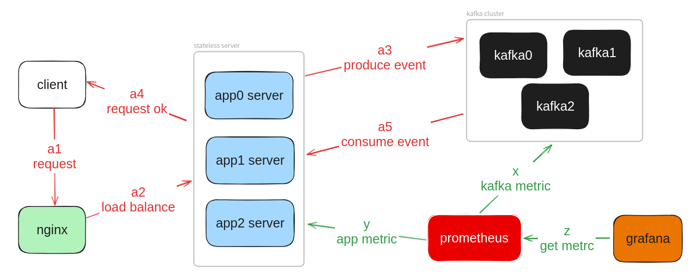
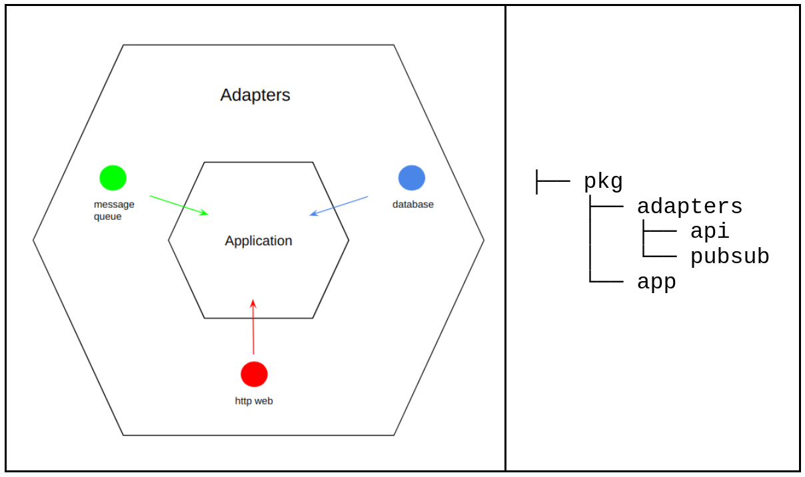

# README

- [README](#readme)
  - [system architecture](#system-architecture)
    - [data flow =\> `a` flow](#data-flow--a-flow)
    - [monitor flow =\> `x, y, z` flow](#monitor-flow--x-y-z-flow)
  - [data flow](#data-flow)
  - [software architecture](#software-architecture)
    - [adapters](#adapters)
      - [api](#api)
      - [pubsub](#pubsub)
    - [app](#app)
  - [create data](#create-data)
  - [service](#service)
  - [Dockerfile](#dockerfile)

## system architecture



### data flow => `a` flow

i.  
kafka 每個 topic 有 3 個 partition.  

ii.  
3 個 app server 同時為 api server, kafka producer, kafka consumer. 搭配 partition 可以加速發布 message 及消費 message 的速度.  

iii.  
app server 和 kafka 都有多個節點, 具有 ha 效果.  

iv.  
3 個 app server 組成一個 kafka consumer group, 精確分配 kafka partition.

v.  
produce evnet 加上 kafka key, 每筆特定的資料, 只會有單一消費者處理. 當多個消費者處理資料時, 也可以保證 message 的順序.  

### monitor flow => `x, y, z` flow

i.  
kafka 預期使用 Kafka Exporter 發送 metric 給 prometheus

ii.  
app server 預期使用 第三方客戶端庫, 主動推送 api endpoint 服務狀態

iii.  
grafana 讀取 prometheus, 進行 monitor 數值視覺化.

## data flow

用戶利用 http 觸發 CreateOrderCommand, 產生 CreatedOrderEvent  

發布事件到外部系統 shipping service, 利用 kafka 消費事件, 進行 CreateShipping  

簡單一句話說明業務流程:  
`when 訂單被創建, then 進行運輸作業`  


## software architecture



此軟體架構的精神是把應用程式的核心邏輯 (application) 與外部世界 (adapters) 的依賴分離，來提高應用程式的可測試性、可擴展性和可維護性。

這種架構使得應用程式的核心邏輯可以不受外部技術變化的影響，從而更加穩定和可靠，箭頭方向表示依賴方向，也就是 adapter 依賴 application 。

### adapters

負責處理與外界的交互，將外部系統、用戶接口等，連接到應用程式。

#### api

負責處理應用程式對外的 API 接口。

接收外部請求並將其轉換為應用程式可以理解的 command 或 query 。


#### pubsub

負責處理發布-訂閱系統的通信。

將應用程式的事件傳遞給其他系統，或從其他系統接收事件並進行相應的處理。

### app

應用程式的主要業務規則。

## create data

```bash
curl -X POST http://localhost:8168/api/v1/orders \
     -H "Content-Type: application/json" \
     -d '{
           "customer_name": "caesar",
           "total_price": 27000
         }'
```

## service

```bash
cd ./deploy && docker compose up -d
```

[docker-compose.yml](deploy/docker-compose.yml)


- app_server:  
    <localhost:8168>
    
- prometheus:  
    <localhost:9090>
    
- grafana:  
    <localhost:3000>  
    user: `root`  
    pw: `1234`
    
-  kafka-ui:  
    <localhost:18080>
      
## Dockerfile

```bash
docker build -f Dockerfile -t x246libra/garmin2024:v0.1.0 . && \
    docker rmi `docker images --filter label=stage=builder -q`
```